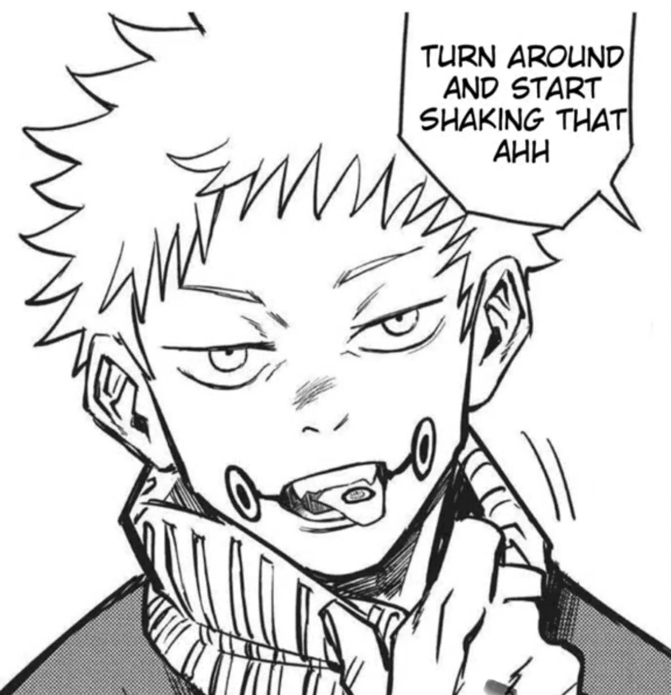
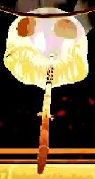
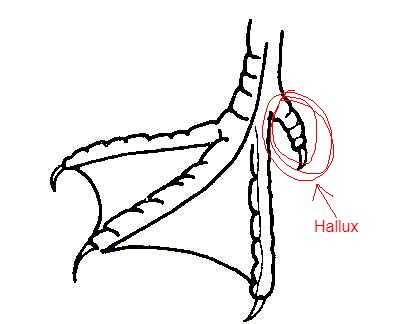

# ~~Cursed Speech~~
Empowered by your deity, you certainly know how to speak volumes

	

You are able to 

- The affected being must be able to hear and understand the language you issued the command in
- Other beings with the ability to use Cursed Speech are immune to it.
- If the spell were to do damage to it, it also does the same amount of damage to the one using it.
- Maybe make it to where both hands need to be busy to cast it
# ~~Blinded in Chains (now became longass tounge)~~
You have two retractable exhaust-like protrusions parallel to your belly button pointed downwards

You use one hand to hold onto your exhaust and another to point at another creature. Chains (or ropes if chains are too much) shoot out from your exhausts, latching towards the ground. 1-3 exhausts (depending on a d3 roll) also pop out of the ground near the affected creature and restrain them, causing both of you to become (either grappled i dunno).

You must keep either one of your hands on your exhaust for this effect to remain. If your opponent breaks all the chains that affect them, the effect ends for the both of you. Others who attempt to remove the chains for them get an advantage on it
# ~~Exposed~~
As long as you maintain line of sight on someone, they become vulnerable to their resistances. However, you become vulnerable to both their resistances and vulnerabilities. 
# ~~Jackpot~~

	

You have formed a 3rd eye above and between your eyebrows. Your pupils can change shape.

This ability allows you to press three fingers directly against your eye balls and spin them. Upon doing this, your eyes can act as slots within a slot machine. Each eye will act as a d3. Take a d10 + 10 damage. Roll a dx (your highest spell level you can cast) and expend a spell slot specified. You cannot use inspiration for the slot machine rolls. You cannot use this attack twice in a row

If you match the number '3' in all slots:
- Add a spell slot of your choice, even if it goes over the amount of spell slots you're supposed to have (if it does go over, it resets upon your next long/short rest).

If you match 3 numbers:
- Restore the spell slot you just expended.

If you match 2 numbers:
- You can move a total hp pool of 40 hp between two willing creatures, but not yourself

If you match no numbers:
- Lose an additional spell slot.
- Either take 2d20 damage or become frightened to whoever you hit last for this and next turn. If there is no valid target, a random one around you is picked.

If you match the number '1' in all slots:
- Lose the highest spell slot you can.
- David gets to teleport you somewhere within 300ft.
- Become unconscious for the turn.
# Ghost hands
You have two magical hands you can form around yourself up to 10 feet away 
| OR | You constantly have two magical hands around yourself that can go up to 10 feet away. They can do stuff the wielder normally can with their hands, like hold swords and flip people off.

However, if you use them to do something that involves numbers, subtract one from the total score. Like if it was a roll or a shield's added AC or something like that.
# ~~Air soles~~
Your feet have little vent holes on the bottom that let your propulse yourself with air. You gain an additional 10 feet of movement.

i dunno maybe if the wings are a thing too you can use both to let yourself not glide downwards but it doesn't grant you the ability to go higher either.
# Wings
You have wings that let you glide, but not fly
# Smite
As a bonus action, you embue your weapon with a smite and hit with it.
# Big Ass Feet
stomping can create a small earthquake that may stun enemies or maybe give them disadvantage on rolls (if that is too strong than maybe half movement speed cause it's a big ass stomp)
# Hallux Heel

	

Little hooks at the end of your feet/hooves that make attacking with them do more damage
# Dimensional/Tactical Awareness
Your Pupil is dilated and your Iris glows brightly. When you eyes aren't obstructed, you are able to see creatures through walls but you suffer significant hearing loss.

This effect doesn't work when you eyes are obstructed, like by a blindfold or a helmet visor. You can still see when your eyes are obstructed, even by your eyelids.